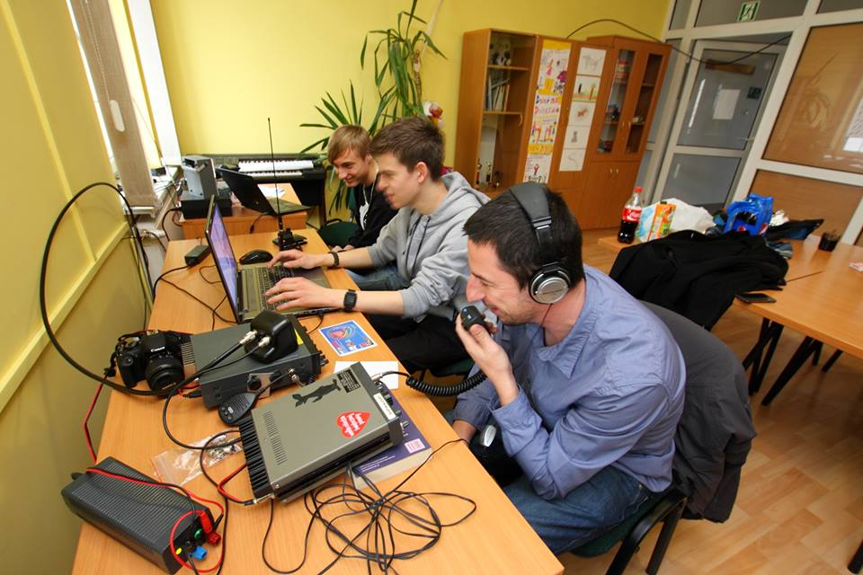
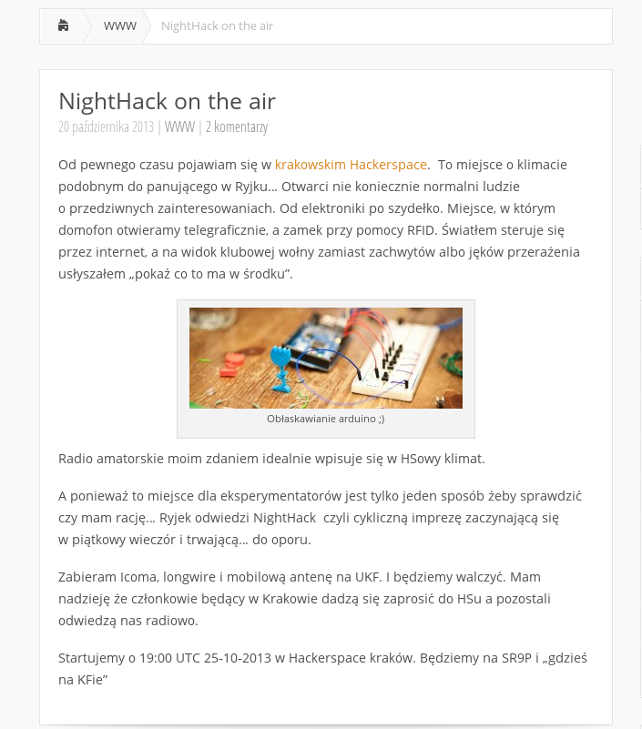

---

layout: ribbon

style: |

    #Cover h2 {
        margin:30px 0 0;
        color:#FFF;
        text-align:center;
        font-size:70px;
        text-shadow: 5px 5px #000000;
        }
    #Cover p {
        margin:10px 0 0;
        text-align:center;
        color:#FFF;
        font-style:italic;
        font-size:20px;
        text-shadow: 5px 5px #000000;
        }
        #Cover p a {
            color:#FFF;
            }
    #Picture h2 {
        color:#FFF;
        }
    #SeeMore h2 {
        font-size:100px
        }
    #SeeMore img {
        width:0.72em;
        height:0.72em;
        }
---

# Krakowskie Kursy Krótkofalarskie {#Cover}

*Ryjek SP9KGP i Hackerspace SP9HACK*

## Początki...

{: height="400px"}

## Jeden oszołom i coś ciekawego

- 1.5kW na 433MHz
- …Własna sieć bezprzewodowa
- …Balon (nie balun) stratosferyczny
- …Mój sygnał na drugim końcu świata
- …Apokalipsa zombie
- …Własne konstrukcje

{:.note}
To tak się da? Oczywiście.

## Plain Text on Your Slides

